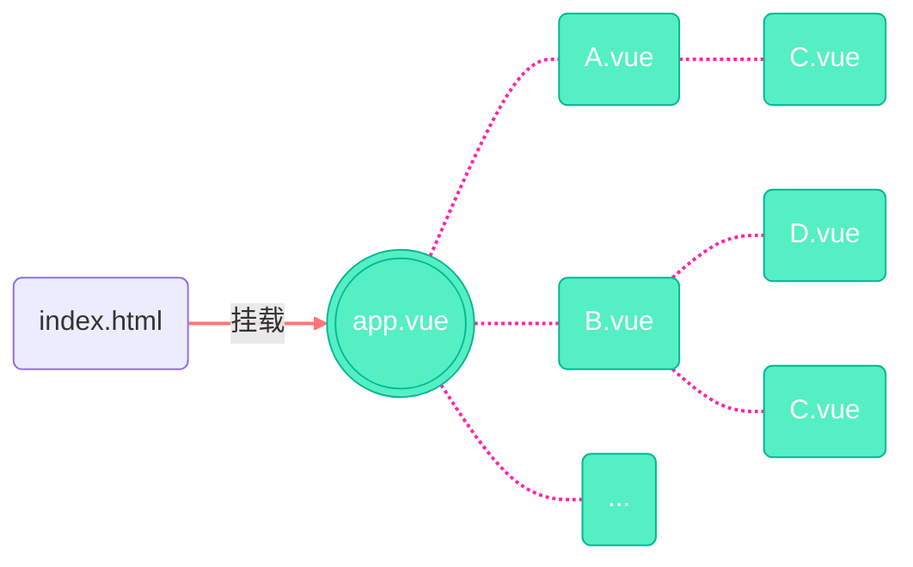

### 1.Vite通用脚手架创建

在powershell终端中输入命令,下载最新版vite构建工具:

```powershell
npm install -g vite@latest
```

安装成功后, 执行下面命令，创建Vue3工程:

```powershell
npm create vite@latest
```

按下enter, 输入你的Vue3项目名, 或者直接在上面的命令后面加上空格+项目名。

项目命名规范遵循npm包命名规则:

- 小写a-z
- 不开头的数字0-9
- 不开头和结尾的连字符`-`
- 不允许空格, 尽量具有语义

若在项目中没有`src/node_modules`目录, 使用如下命令尝试下载所需依赖:

```powershell
npm install
```

> 一般是网络原因, 依赖冲突, npm版本过低等等.

尝试运行:

```powershell
npm run dev
```

### 2.Vue脚手架创建

```powershell
npm install -g vite@latest
```

```powershell
npm create vue@latest
```

工程结构中若有报错，检查是否存在`src/node_modules`目录，若没有则执行以下命令：

```powershell
npm install
```

### 3.两种创建方式的区别

后者创建工程目录中会多一个文件：`env.d.ts`，“env->environment”，是Vue3项目中用于定义全局类型声明的TypeScript文件，让TS编译器提前知道那些只在Vite阶段才存在的全局变量或模块。


在VIte创建的Vue3工程中，`tsconfig.app.json`中的`types`配置项也可以实现让TS编译器提前知道只有在Vite运行时才存在的全局变量或模块：


### 4.Vue3工程结构

```txt
project-root/
├── .vscode/                 # VS Code 工作区配置（插件推荐、调试、代码片段等）
├── node_modules/            # npm 安装的依赖包（只读）
├── public/                  # 静态资源目录，原样发布到服务器根路径
├── src/                     # 业务源码
│   ├── components/          # 全局复用 Vue 组件
│   ├── App.vue              # 根组件
│   └── main.ts              # 入口脚本，createApp挂载
|
├── .gitignore               # Git忽略规则
├── env.d.ts                 # 全局类型声明：让 TS 认识 import.meta.env、*.vue 等
├── index.html               # Vite的入口文件
|
├── package.json             # 依赖列表、脚本命令、项目元信息
├── package-lock.json        # 精确版本锁（npm）
├── tsconfig.json            # TypeScript根配置，显式引用下面两个
├── tsconfig.app.json        # 针对src源码的TS 配置（浏览器端）
├── tsconfig.node.json       # 针对Vite配置、脚本、测试的TS 配置（Node端）
└── vite.config.ts           # Vite构建配置：插件、别名、代理、优化等
```

我们主要关注`src`目录。

#### 4.1 入口脚本

`src/main.ts`中：

```ts
import { createApp } from "vue";
import App from "./App.vue";

createApp(App).mount("#app");
```

当浏览器加载`index.html`时，解析到下面的`<script>`时：

```html
<script type="module" src="/src/main.ts"></script>
```

- 从vue包中引入createApp工厂函数。
- 引入App.vue。
- 创建一个Vue应用实例，挂载到`index.html`对应的容器中。

```html
<div id="app"></div>
```

- Vue接管该DOM节点的渲染与更新。

#### 4.2 根组件

`src/App.vue`中：

```vue
<template>
  <div class="app"></div>
</template>

<script>
export default {
  name: "App", //组件名配置项
};
</script>

<style></style>
```

**根组件与其他组件之间的关系**：“根组件统领全局（其他子组件），子组件嵌套复用”。



**并非只可单个Vue应用实例**。

在`src/main.ts`中：

```ts
import { createApp } from "vue";
import App1 from "./components/App1.vue";
import App2 from "./components/App2.vue";

const app1 = createApp(App1);
const app2 = createApp(App2);

app1.mount("#app1");
app2.mount("#app2");
```

### 5.起初的响应式

- 访问某个数据的函数，称其为这个数据的依赖(者)
- 当数据发生变化时，相关依赖重新调用

```html
<head>
  <meta charset="UTF-8" />
  <meta name="viewport" content="width=device-width, initial-scale=1.0" />
  <title>Document</title>
  <script src="./vuem.js"></script>
</head>
<body>
  <p id="name"></p>
  <input type="text" oninput="user.name = this.value" />
  <p id="age"></p>
  <input type="text" oninput="user.age = this.value" /><br />
  <input type="date" /><br />
  <button>change</button>
  <script src="./index.js"></script>
</body>
```

```js
let user = {
  name: "bloom",
  age: 17,
};

observe(user);

function render() {
  const nameP = document.querySelector("#name");
  const nameA = document.querySelector("#age");

  nameP.innerHTML = user.name;
  nameA.innerHTML = user.age;
}

run(render);
```

```js
let global = null; //全局变量用于存放依赖(函数)

function run(func) {
  global = func;
  func();
  global = null;
}

function observe(obj) {
  for (key in obj) {
    let currentValue = obj[key]; //当前属性值
    let dependencies = []; //依赖管理器

    Object.defineProperty(obj, key, {
      get: function () {
        // 依赖搜集
        if (global && !dependencies.includes(global)) {
          dependencies.push(global);
        }
        return currentValue;
      },

      set: function (value) {
        currentValue = value; //修改当前值

        // 派发更新
        for (let i = 0; i < dependencies.length; i++) {
          dependencies[i]();
        }
      },
    });
  }
}
```

- 遍历对象的每个属性，为每个属性创建独立的当前属性值变量和依赖管理器(数组)（闭包）
- 重写属性的getter和setter：
  - getter：若依赖存在且未被收集，则放入依赖管理器，最后返回当前属性值（依赖收集）
  - setter：更新当前属性值，遍历执行每个依赖（派发更新）
- 如何拿到依赖：依赖执行前被交给一个全局变量，执行时调用getter可以拿到即可
