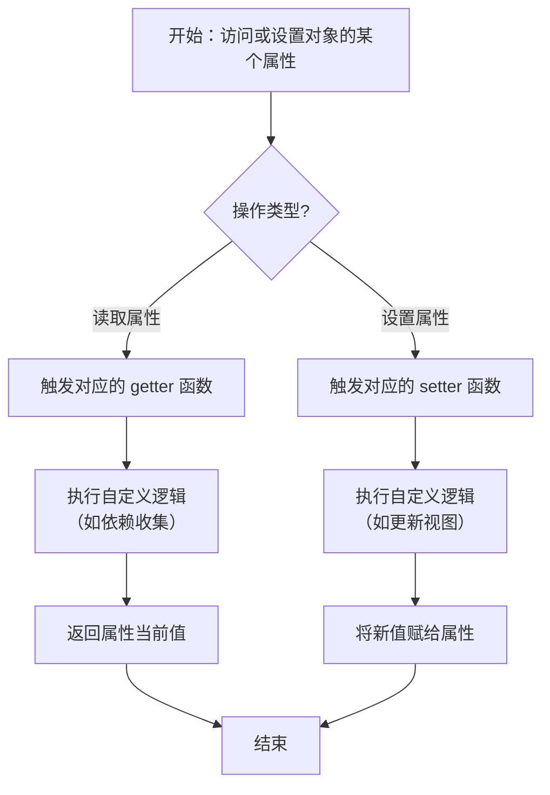
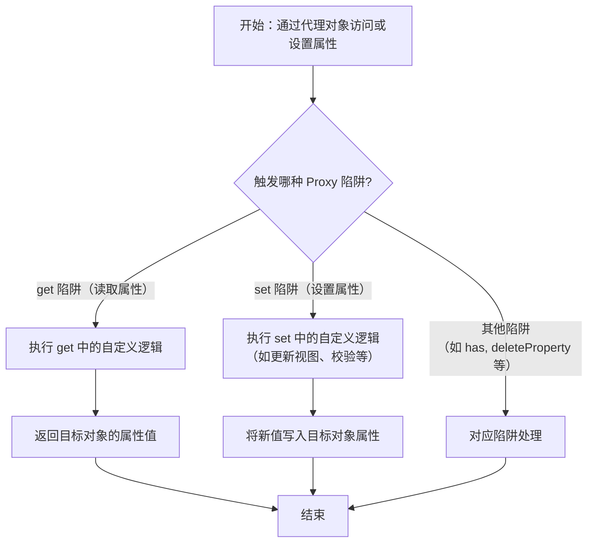
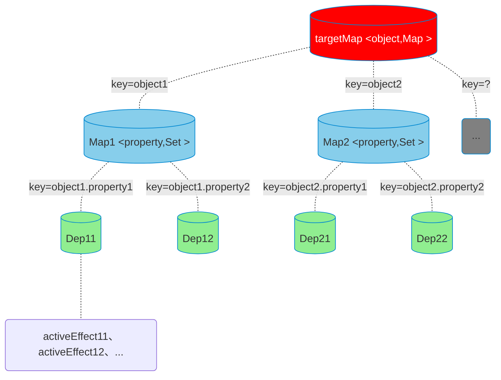
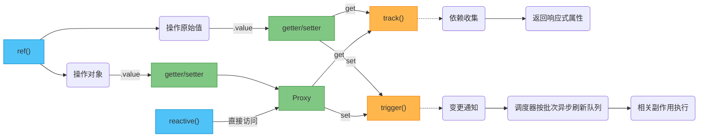
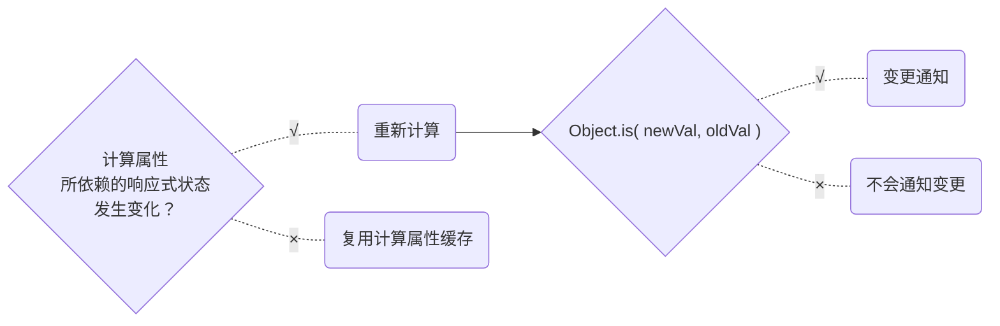

### 1.Vue响应式系统

- reactive state，被 Vue 响应式系统追踪、变化能自动触发视图更新的数据


#### 1.1 底层-数据劫持

- 在数据被读取或更新时，拦截默认行为并注入自定义逻辑


- 在JavaScript中有两种数据劫持的实现方式：getter/setter、Proxy


##### （1）getter/setter



##### （2）Proxy




#### 1.2 全局依赖管理

- 一个名为targetMap的WeakMap对象，负责存储所有响应式对象与其相关副作用之间的映射关系
- 目标对象→指定属性名→对应副作用



> targetMap 只存在于 Vue 的响应式包（`@vue/reactivity`）内部，不会挂到任何 Vue 组件实例上，也不会通过 `this` 暴露给用户


##### （1）依赖管理器

```js
// 存储所有响应式对象的依赖关系
const targetMap = new WeakMap()

// 当前正在运行的副作用（如渲染函数、watch、computed等）
let activeEffect = null
```


##### （2）依赖收集器

```js
function track(target, key) {
    if (!activeEffect) return

    let depsMap = targetMap.get(target)
    if (!depsMap) {
        depsMap = new Map()
        targetMap.set(target, depsMap)
    }

    let dep = depsMap.get(key)
    if (!dep) {
        dep = new Set()
        depsMap.set(key, dep)
    }

    dep.add(activeEffect)  // 将当前副作用添加到依赖集合
}
```


##### （3）派发更新器

```js
// 触发更新
function trigger(target, key) {
    const depsMap = targetMap.get(target)
    if (!depsMap) return

    const dep = depsMap.get(key)
    if (dep) {
        dep.forEach(effect => effect())  // 重新执行所有依赖的副作用
    }
}

// 简单的副作用函数
function effect(fn) {
    activeEffect = fn
    fn()          // 立即执行一次，触发依赖收集
    activeEffect = null
}
```


#### 1.3 创建响应式状态API



##### （1）reactive()

```js
function reactive(target) {
  // 只处理对象类型
  if (typeof target !== 'object' || target === null) {
    return target
  }

  // 创建 Proxy 拦截器
  const handler = {
    get(target, key, receiver) {
      // 依赖收集
      track(target, key)

      // 返回属性值，如果属性值是对象则递归转为响应式
      const result = Reflect.get(target, key, receiver)
      return reactive(result)  // 注意：这里是惰性递归，仅在读取时转换
    },

    set(target, key, value, receiver) {
      const oldValue = target[key]
      const result = Reflect.set(target, key, value, receiver)

      // 只有当值真正变化时才触发更新
      if (oldValue !== value) {
        trigger(target, key)
      }
      return result
    }
  }

  return new Proxy(target, handler)
}
```


### 2.ref()

#### 2.1为原始值添加响应性

```ts
const words = ref("hello world");
console.log("words:");
console.log(words);
console.log("words.value:");
console.log(words.value);
```


`words.value`重新赋值后, 仍然是一个响应式数据


#### 2.2 为对象添加响应性

```ts
const user = ref({
  userName: "user name",
  userPhone: "xxxxxxxxxxx",

  userFamily: {
    father: "f",
    mother: "m",
  },
});
console.log("user:");
console.log(user);
console.log("user.value:");
console.log(user.value);
```

在控制台我们可以看到:


`user.value.userName`和`user.value.userPhone`重新赋值后, 也仍然是一个响应式数据.


#### 2.3  \_rawValue、\_value、value间的联系

| RefImpl属性名 | 是否可以直接访问 | 描述                         |
| ------------- | ---------------- | ---------------------------- |
| `_rawValue`   | ×                | 存储原始值                   |
| `_value`      | ×                | 存储原始值被响应式代理后的值 |
| `value`       | √                | 外部访问入口                 |

- `toRaw(value)`: 剥离响应式代理，返回原始对象或原始类型值
- ` convert(value)`:对象类型转为响应式代理，原始类型值直接返回
- `ref()`执行时，`_rawValue` 、`_value` 分别保存`toRaw(value)` 、 `convert(value)` 的返回值
- 当使用访问器属性`value`进行修改时，`toRaw(newValue)`的返回值与`_rawValue`进行引用对比(严格的"===")；只有不等时，才同步更新`_rawValue`和`_value`, 同一事件循环内的多次修改, 会在所有同步代码执行后批量更新


#### 2.4 在模版中使用响应式数据

```vue
<h2>{{ user.userName }}</h2>
<h2>{{ user.userPhone }}</h2>
```

为什么呢? 详情请见下文~~


### 3. reactive()

#### 3.1 仅为对象添加响应性

```ts
const friend = reactive({
  name: "friend",
  sex: "male",
});
console.log("friend:");
console.log(friend);
console.log(friend.name);
console.log(friend.sex);
```


`friend.name`和`friend.sex`可以直接修改，仍然是响应式。


#### 3.2 局限

- 底层使用的是JavaScript的Proxy API，而Proxy只能代理JavaScript对象。
- `ref.value`可以直接替换且保持响应性，reactive**不能直接替换成新的对象，否则失去响应性！**


#### 3.3 在模版中使用

```vue
<h2>{{ friend.name }}</h2>
<h2>{{ friend.sex }}</h2>
```


### 4. ref解包

`RefImpl`对象`ref`就是这里所谓的"包"，**ref解包就是写ref，拿到ref.value**。


- 在js文件中, 我们希望访问ref存储的响应式数据，我们只能通过ref.vlaue实现。
- 在js文件中，作为普通对象属性的ref，需要手动.value。
- 在模版中，ref会自动解包。
- 在模版中，作为ref1属性的ref2、reactive也会自动解包。
- 在js文件、模版中，reactive是一个Proxy对象，响应式对象都会解包。

> 在模板中，访问 `setup()` 返回的**顶层 ref 属性**，Vue 自动解包。
>


### 5. 响应式对象解构-保留响应性

#### 5.1 直接解构的问题

直接解构ref（RefImpl响应式对象）或者reactive（Proxy响应式对象）的响应式属性，都会导致拿到非响应式数据！


#### 5.2 toRefs()和toRef()

- `toRefs()`可以保留响应性地解构ref和reactive。

- `toRef(target, key)`仅用于保留响应性地解构出reactive 注意不能解构ref!


### 6.计算属性

Computed Properties，一种派生响应式状态，依赖其他响应式状态 的响应式状态。

特点：**“默认只读、有缓存、懒计算”**。


#### 6.1 computed()

该API的参数是一个getter函数。

```js
import { computed, ref } from "vue";
let surname = ref("");
let forename = ref("");
let capitalInitialSurname = computed(() => {
  return surname.value.slice(0, 1).toUpperCase() + surname.value.slice(1);
});
let name = computed(() => {
  return capitalInitialSurname.value + "." + forename.value;
});
```


#### 6.2 计算属性 VS 函数调用

计算属性会被Vue缓存，只有所依赖的响应式状态发生改变时，才会重新计算，若新值与旧值不同，Vue会进行变更通知。




- **缓存机制**：依赖未变时直接返回旧值，避免重复计算，显著降低渲染开销。
- **依赖追踪**：仅在其显式依赖的响应式数据变化时才重新求值，杜绝无关刷新。
- **链式组合**：可相互引用，Vue 自动维护多级缓存与级联更新，代码简洁且高效。
- **声明式数据**：被视为响应式数据，支持调试工具追踪、可被其它计算属性 / Store getter 直接引用，提升可维护性与可观测性。


#### 6.3 *设置可写

同时提供计算属性的getter和setter，通常setter中需要解构(compute)赋值(依赖的响应式状态)。


```js
import { computed, ref } from "vue";
let surname = ref("");
let forename = ref("");

let c = computed({
  set(newValue: any) {
    [surname.value, forename.value] = newValue.split(".");
  },
  get() {
    return surname.value + "." + forename.value;
  },
});

function updateC() {
  console.log("updateC调用了~");
  c.value = "hello.world";
  console.log(c.value);
}
```

> 当updateC()调用时，可以成功修改计算属性c所依赖的两个响应式状态surname和forename。
