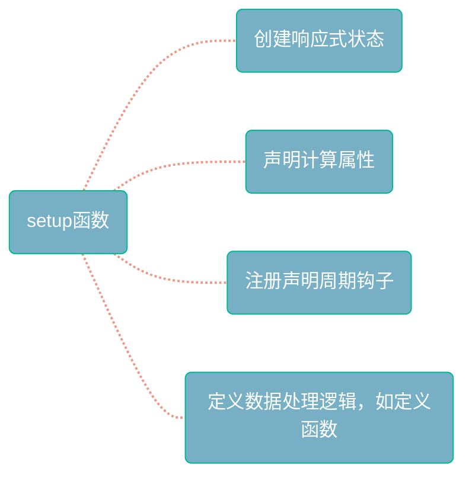

### 1.setup()

组合式API的入口函数。通俗的说，`setup()`是Vue组件使用组合式API的“入口”


#### 1.1 使用时机？

- 非单文件组件中需要使用组合式API时
- 基于选项式API的组件中嵌入组合式API的代码


#### 1.2 初始化起点

```vue
<script lang="js">
import { ref } from 'vue';

export default {
    setup(){
        let v1 = ref(1);
        let v2 = ref(2);
        let v3 = ref(3);
        let v0 = 0;
        return {v1,v2,v3,v0}
    },
    data(){
        return {
            v0:1,
            v3:0,
            v4:4,
            v6:6,
        }
    },
    computed:{
        v4(){
            return 0;
        },
        v5(){
            return 5;
        },
    },
    methods:{
        showVueComponent(){
            console.log(this);
        },
        v5(){
            console.log('hello world');
        },
        v6(){
            console.log("hello world");
        }
    }
}
</script>

<template>
  <div>
    <p>v1:{{ v1 }}</p>
    <p>v2:{{ v2 }}</p>
    <p>v3:{{ v3 }}</p>
    <p>v4:{{ v4 }}</p>
    <p>v5:{{ v5 }}</p>
    <p>v6:{{ v6 }}</p>
    <p>v0:{{ v0 }}</p>
    <button @click="showVueComponent">show current Vue Component</button>
    <button @click="v6">test v6</button>
  </div>
</template>

<style scoped></style>
```

**setup()、data、computed、methods中有同名属性时，保留情况为computed>data>setup()>methods；**

**无论setup()返回的是否为响应式状态。**


#### 1.3 setup()的作用




### 2.setup属性

Vue3 引入的语法糖. 

我们通过它可以在Simple File Component(单文件组件) 中无需显示调用setup()并返回值 而使用组合式API！


#### 2.1 添加到一个script元素

```vue
<script>
	export default {
        name :'ComponentName',
    }
</script>

<script setup></script>
```

Vue编译器会将具有默认导出的和具有`setup`属性的`<script>`合并在同一个组件定义中。


#### 2.2 合并默认导出

可以使用安装插件将上面的两个`<script>`放在一起:

```powershell
npm i vite-plugin-vue-setup-extend -D
```


在vite.config.ts中:

```ts
import VueSetupExtend from 'vite-plugin-vue-setup-extend'
export default defineConfig({
    plugins: [VueSetupExtend()],
})
```


在组件中可以写成:

```vue
<script lang="ts" setup name="ComponentName"></script>
```


### 3.setup语法糖中的await

顶层 await自动包裹成异步组件，而异步组件必须被 \<Suspense\> 包围才能渲染。


```vue
<script setup lang="ts">
const store = useNoteStore()
await store.search(route.params.name)   // 顶层 await
</script>
```

等价于：

```ts
export default defineAsyncComponent(() => import('./NoteShowBox.vue'))
```

两种解决方式：

- 外部包装一层\<Suspense\>。
- 放到声明周期钩子或者普通函数中。
