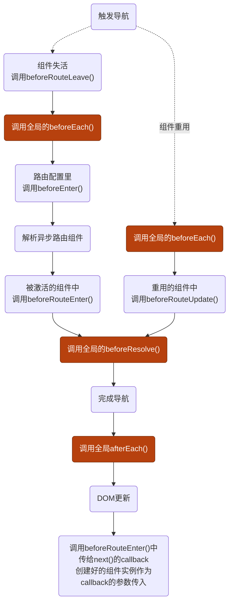

### 1.hello，vue-router！

（1）下载`vue-router`依赖：

```powershell
npm i vue-router@4
```

（2）然后创建`src/router`子目录，以及`src/router/index.ts`。

（3）`src/router/index.ts`中编写路由规则

```ts
const routes = [
  {
    path: "/home",
    component: Home,
  },
];
```

（4）`src/router/index.ts`中创建路由器并导出

```ts
const router = createRouter({
  history: createWebHistory(),
  routes,
});
export default router;
```

（5）`src/main.ts`中使用该路由器（插件）

```ts
import router from "./router";

createApp(App).use(router).mount("#app");
```

**这一步干了些什么**：

- 全局注册`<RouterView>`和`<RouterLink>`组件。
- 添加全局`$router`和`$route`，每个组件都有这两个实例属性。
- 允许我们使用`useRouter()`和`useRoute()` 组合式API。
- 触发路由器解析初始路由。

（6）测试，使用`<RouterView>`和`<RouterLink>`。

```vue
<template>
  <router-link to="/home">go to home</router-link>
  <router-view></router-view>
</template>
```

点击“go to home”链接后会URL就刷新了！

注意，`<RouterLink>`最终会被解析成`<a>`。

#### 路由历史模式

##### （1）Hash模式

在实际URL中，路由路径前使用一个`/#`。

```ts
{history:createWebHashHistory(),}
```

##### （2）Memory模式

Node环境和SSR使用。

```ts
{history:createMemoryHistory(),}
```

##### （3）HTML5模式-通常

```ts
{history:createWebHistory(),}
```

### 2.to属性的两种写法

#### 2.1 to字符串

当路由比较简单，不带有`params`或者`query`时可以使用一下。

```vue
<router-link to="/login">login</router-link>
```

#### 2.2 to对象

使用`v-bind`给`to`属性传递一个路由配置对象。

```vue
<router-link
  :to="{
    path: '/login',
  }"
>login</router-link>
```

### 3.携带参数

#### 3.1 params

##### （1）字符串写法

- 首先为路由规则中`path`添加路径参数占位符
- 在路由路径字符串中直接写参数

```ts
path: "/login/:id";
```

```vue
<router-link to="/login/007">login</router-link>
```

使用模版字符串，添加动态性：

```ts
let id = ref("007");
```

```vue
<router-link :to="/login/${id}">login</router-link>
```

##### （2）对象写法中使用path配置，就不能添加params配置。🤣

Vue-Router的硬规则，就算写params配置，也会被忽略。

#### 3.2 query

##### （1）字符串写法

- 直接添加到路由路径中

```ts
path: "/login";
```

```vue
<router-link to="/login?id=007">login</router-link>
```

使用模版字符串，增加动态性：

```ts
let id = ref("007");
```

```vue
<router-link :to="`/login?id=${id}`">login</router-link>
```

##### （2）对象写法

```ts
let id = ref("007");
```

```vue
<router-link
  :to="{
    path: '/login',
    query: {
      id,
    },
  }"
>login</router-link>
```

注意，`query`对象中的`id`属性使用了ES6的属性简写

​

#### 3.3 仅路径参数变化：复用

- 无论使用路径参数还是查询参数，只要path相同，路由匹配到的组件实例都会被复用
- 比如，当我们在从`users/u1`导航到`users/u2`时，组件实例会被复用！

##### 控制台小问题

若直接写下面的内容：

```vue
<input type="text" v-model="id" />
<router-link :to="`/login/${id}`">loginr</router-link>
```

注意，模版中的`userId`是一个响应式状态ref

**有一个问题**：


**解决：**

- 我们可以使用`v-if="userId"`来规避`/users/`。
- 在路由匹配规则中添加`"?"`：`path:'/login/:id?'`

### 4.路由的命名与嵌套

#### 4.1 路由配置对象起名

- 在路由配置对象中，使用`name`配置项，给路由配置对象起一个**唯一的名字**

```ts
{
    name: "login",
    path: "/login",
    component: Login,
  },
```

对应的导航：

```vue
<router-link
  :to="{
    name: 'login',
  }"
>login</router-link>
```

##### （1）优点

- 跳转配置写法更加简洁，解耦使用URL的硬编码
- params可以自动Unicode编码、解码
- 解决因路由规则声明的先后顺序，导致**“路由截胡”**

##### （2）解决使用path配置而不能添加params配置。😀

```ts
{
    name: "login",
    path: "/login/:id?",
    component: Login,
  },
```

```ts
let id = ref("007");
```

```vue
<router-link
  :to="{
    name: 'login',
    params: {
      id,
    },
  }"
>login</router-link>
```

#### 4.2 嵌套路由

在路由配置对象中，使用`children`配置项，将一组子路由挂载到父路由下面。

##### （1）不忽略父组件

向`children`路由数组中添加子路由规则，不要以`/`开头：

```ts
{
    path: "/users/:userId",
        component: User,
            children: [
                {
                    path: "hobby",
                    component: Hobby,
                },
            ],
},
```

**一旦以 `/` 开头，就会被 Vue-Router 视为根路径，而不是相对路径。**

对应路由跳转配置：

```vue
<router-link :to="`/users/${$route.params.userId}/hobby`">hobby</router-link>
```

##### （2）忽略父组件

根据路由的父子关系，不使用`component`配置而不嵌套路由组件，父路由组件对应的`<RouterView>`占位符会跳过父级，直接使用子路由组件。

```ts
{
    name: "frontend",
    path: "/frontend",
    children: [
      {
        name: "frontend-vue",
        path: "vue",
        component: VueStudy,
      },
    ],
  },
```

对应导航配置：

```vue
<router-link
  :to="{
    name: 'frontend-vue',
  }"
>hobby</router-link>
```

##### 父路由组件和子路由组件没有继承关系！

### 5.编程式导航

不使用`<RouterLink>`，通过调用路由器实例提供的API，命令式触发路由跳转。

**拿到路由器实例**：`const router = useRouter();`

然后：

- 导航到不同位置：`router.push(to)`

- 替换当前位置（不能回退到上一个路由）：`router.replace(to)`

- 前进或后退（几个路由）：`router.go(n)`

> 上面的三个方法模仿的是`window.history`的API。

### 6.给视图命名

跳转到同一级路由时渲染多个路由组件。

- 在路由配置对象中使用`components`配置项，其属性名作为视图名称，属性值就是路由组件
- 给需要指定展示某个路由组件实例的`<router-view>`添加`name`属性

```ts
{
    name: "home",
    path: "/home",
    components:{
        default:HomeMenu,
        catalog-sidebar:DocCatalog,
        content-container:DocContent,
    }
  },
```

对应的：

```vue
<div>
    <router-view />
    <div class="seperate-line">
    <router-view name="catalog-sidebar"/>
    <router-view name="content-container"/>
</div>
```

### 7.重定向和别名

#### 7.1 路由重定向

在路由配置对象中使用`redirect`配置项，其值可以是路由路径字符串，

```ts
{
    path: "/home",
    redirect: "/",
}
```

```ts
{
    name:"home"
    path: "/home",
    redirect: "/",
},
{
    path: "/house",
    redirect: {
        name:'home'
    },
}
```

##### （1）拿到目标路由参数

```ts
{
    path: "/login/:id",
    redirect: to=>{
        return {
            path:'/login',
            query:{
                id:to.params.id
            }
        }
    },
}
```

##### （2）重定向到相对位置

```ts
{
    path: "/login/",
    redirect: to=>{
       //使用字符串的替换
        return to.path.replace("/login","/register")
    }
}
```

#### 7.2 给路由起别名

其实就是指向同一个路由组件的不同的路由路径。

##### （1）不携带路由参数

```ts
{
    path: "/home",
    alias: "/house",
    redirect: "/",
}
```

##### （5）携带路由参数

```ts
{
    path: "/login/:id",
    alias: ["/:id",""],//""代表根路由:“/”
}
```

比如：\*/007，URL不变，实际上是跳转路由：\*/login/007。

### 8.将参数变成props

在路由配置对象中，使用`props`配置项，将`route`对象中的参数转换成props，但是URL不会改变

#### 8.1 三种模式（写法）

##### （1）布尔模式

- 当`props`设置成`true`后，仅`route.params`可被设置成props
- 对于有多个路由组件而**使用命名视图**的路由，**必须一一指定**每个命名视图（属性名）的props配置。

```ts
{
    path: "/login/:id",
    component:Login,
    props:true
},
{
    path: "/Home/:color",
    components:{
        aside:Aside,
        default,Main
    },
    props:{
        default:true,
        aside:false,
    }
}
```

声明接受props，比如Aside组件中：

```ts
const props = defineProps(["id"]);
```

##### （2）对象模式

用于传递静态值。

```ts
{
    path: "/login",
    component:Login,
    props:{
        id:"007"
    }
},
{
    path: "/Home",
    components:{
        aside:Aside,
        default,Main
    },
    props:{
        default:{
            color:"black"
        },
    }
}
```

声明接受props，比如Main组件中：

```ts
const props = defineProps(["color"]);
```

##### （3）函数模式

params参数和query参数都可以变成props。

```ts
{
    path: "/login",
    component:Login,
    props:route=>({query:route.query})
},
```

在Login组件中声明要接受的props：

```ts
let props = defineProps(["query"]);
```

然后`props.query`就可以拿到query参数了。😊

### 9.路由导航守卫

`vue-router`提供的API，用于通过跳转或取消的方式保护导航。

#### 9.1 导航解析流程



#### 9.2 全局导航守卫

##### （1）beforeEach()

**前置守卫**，当一个导航触发时，全局前置守卫（函数）按照创建顺序调用被调用。

守卫是异步调用的，**在所有守卫settled前，导航一直处于等待中**。（Promise对象的状态）

```ts
router.beforeEach((to, from) => {
  console.log("to:", to);
  console.log("from", from);
});

router.beforeEach((to, from) => {
  return false;
});
```

- `to`：目标路由
- `from`：当前即将离开的路由

**返回值**

- `false`：取消当前导航。
- 一个路由配置对象：中断当前导航，使用`from`创建一个新导航。效果与调用`router.push()`一致。
- `undefined`或者`true`，表示通过守卫。

**\*next参数**

作为第三个参数，通常不用显式调用，与返回值的效果一致。

```ts
router.beforeEach((to, from, next) => {});
```

##### （2）beforeSolve()

**解析守卫**，导航链条中拦截的最后一关，在导航被确实前&&所有组件内守卫调用后&&异步路由组件被解析后 调用。

```ts
router.beforeResolve((to, from) => {});
```

##### （3） afterEach()

**后置钩子**，路由组件实例创建、渲染完成后调用。

```ts
router.afterEach((to, from[, failure]) => {})
```

`failure`：

#### 注入数据

在根组件实例`app`（`createApp()`调用的返回值）中使用`provide()`提供数据，导航守卫使用`inject()`拿到。

#### 9.3 路由独享与组件内定义

##### （1）路由配置独享的守卫

在路由配置对象中指定。

`beforeEnter()`：在进入路由时触发，不会在params、query、hash改变时触发；在嵌套路由中，放到父级路由上，子路由间变化不会触发。

##### （2）组件内的守卫

- `beforeRouteEnter(to, from)`：在渲染该路由组件的对应路由被验证前调用。
- `beforeRouteUpdate(to, from)`：路由改变，当前路由组件被复用时调用。（比如仅改变params参数）
- `beforeRouteLeave(to, from)`：在导航离开渲染该路由组件的对应路由时调用。
