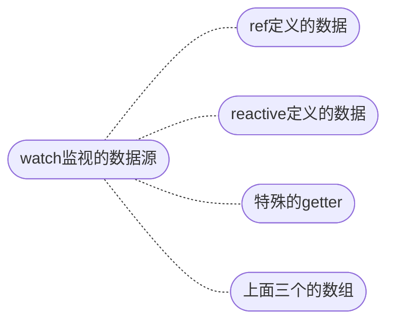

在响应式状态改变的时候, 我们希望一些"副作用"

```ts
watch(source, callback[, options])
```

### 1.监视范围



### 2.监视ref

约定，ref是RefImpl对象

- 非对象类型的值得到的ref，可以直接监视

- 对象类型的值得到的ref：
  - 监视ref或()=>ref.value，仅当ref的引用变化是触发

  - 传递第三个参数{deep: true}，ref的引用变化或propertyName属性变化都会触发

  - 监视()=>ref.value.propertyName，当propertyName属性变化时触发

> ① 可以直接监视由原始类型的值得到的ref。
>
> ② 也可以直接监视由没有嵌套对象的对象得到的ref本身和其响应式属性，后者需要写成箭头函数。
>
> ③ 监视由嵌套对象（inner）的对象（outer）得到的ref很复杂；通常`ref(outer)`的值`outerRef`中有`innerProxy`（一个Proxy响应式对象）：
>
> - `outerRef.value`作为`source`，**仅**当`outerRef.value`引用变化时有效；开启深度监视，可以跟踪所有属性！
> - `outerRef.value.innerProxy`作为`source`，**仅**当`outerRef.value`的引用没有改变且`outerRef.value.innerProxy`变化时有效；当`outerRef.value`的引用改变时，该监视会失效！开启深度监视，效果一样。
> - `()=>outerRef.value.innerProxy`作为`source`，**仅**当`outerRef.value`的引用改变时有效；开启深度监视，当`outerRef.value`改变或者`outerRef.value.innerProxy`变化都有效！
> - 非对象响应式属性写成`()=>notOject`作为`source`；当`outerRef.value.notObject`变化或者`outerRef.value`引用改变时都有效；开启深度监视，效果一样。
>
>   注意，**深度监视**，`watch(source,callback,{deep:true})`，递归跟踪源的所有属性；有效指的是调用`callback`。

| source                      | 是否开启深度模式 | 监视有效的前提                               |
| --------------------------- | ---------------- | -------------------------------------------- |
| `basic`                     |                  | 重新赋值                                     |
| `outer.value`               | ×                | `outer.value`引用变                          |
| `()=>outer.value.notObject` | ×/√              | `outer.value`引用、`outer.value.notObject`变 |
| `outer.value.inner`         | ×/√              | `outer.value.inner`变且`outer.value`引用不变 |
| `()=>outer.value.inner`     | ×                | `outer.value`引用变                          |
| `()=>outer.value.inner`     | √                | `outer.value`引用、`outer.value.inner`变     |

- basic是原始类型值对应的`RefImpl`对象。
- outer和inner都是`Proxy`对象，虽然是由`ref()`得到的。

### 3.监视reactive

规定，reactive就是reactive()返回的Proxy对象

- 监视reactive时，强制开启深度监视

- 修改整个reactive，响应性直接丢失，因此也是不能监视的！

### 4.监视多源

- `watch()`第一个参数使用数组,` callback`的两个参数 `newValue`和`oldValue`也会是数组

- 也可以使用{deep:true}

### 5.其他配置

##### （1） 组件挂载后立即执行一次

`callback`的第三个参数为“`{immediate:true}`”

##### （2） 源变化后仅触发一次

`callback`的第三个参数为“`{once:true}`”

### 6.WatchEffect

#### 3.1 为何使用WatchEffect()

`watchEffect()`允许自动跟踪回调函数中的响应式依赖.

响应式状态常常在`callback`中出现, 我们可以使用该方法简写`watch()`.

```ts
let data1 = ref("data1");
let data2 = reactive({
  data2: "data2",
});

watchEffect(() => {
  if (data1.value !== data2.data2) {
    console.log("no same");
  } else {
    console.log("same");
  }
});
```

#### 3.2 与watch()的比较

##### **“`watch()`较精确，`watchEffect()`较自动。”**

`watch` 和 `watchEffect` 都能响应式地执行有副作用的回调。

它们之间的主要区别是追踪响应式依赖的方式：

- `watch` 只追踪明确侦听的数据源。它不会追踪任何在回调中访问到的东西。另外，仅在数据源确实改变时才会触发回调。`watch` 会避免在发生副作用时追踪依赖，因此，我们能更加精确地控制回调函数的触发时机。
- `watchEffect`，则会在副作用发生期间追踪依赖。它会在同步执行过程中，自动追踪所有能访问到的响应式属性。这更方便，而且代码往往更简洁，但有时其响应性依赖关系会不那么明确。
